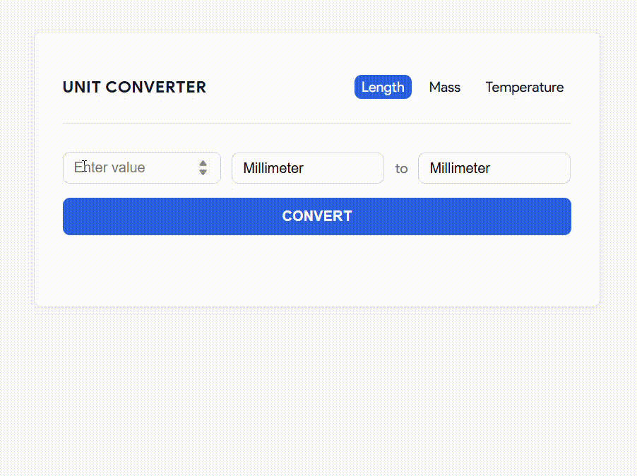

# Unit Converter Web App

A simple Flask-base web application for converting between length, mass, and temperature units.

# Preview

Here's a quick look at the Unit Converter in action:



## Features

- Convert values between different length, mass, and temperature units
- Clean and responsive interface using HTML + CSS
- Form remembers your last input on submit
- Error handling for invalid inputs
- Organized modular Python backend

### Availabe Units of Measurement

- Length: millimeter, centimeter, meter, kilometer, inch, foot, yard, mile
- Mass: milligram, gram, kilogram, ounce, pound
- Temperature: Celsius, Fahrenheit, Kelvin

## Getting Started

1. Clone the repo

```bash
git clone https://github.com/pdmg-dev/unit-converter-web.git
cd unit-converter-web
```

2. Install dependencies

```bash
pip install Flask
```

3. Run the app

```bash
python app.py
```

Visit http://127.0.0.1:5000 in your browser.

## Project Structure

```bash
unit-converter-web/v2-final/
│
├── app.py               # Main Flask app
├── converter.py         # Conversion logic (modularized)
├── static/
│   └── style.css        # Custom styling
├── templates/
│   ├── base.html        # Shared base template
│   ├── length.html      # Length conversion page
│   ├── mass.html        # Mass conversion page
│   └── temperature.html # Temperature conversion page
├── .gitignore
├── LICENSE
└── README.md            # You're here!
```

## License

This project is open-source. Feel free to fork, extend, and improve.

## Project Source

This project was developed following the [Unit Converter](https://roadmap.sh/projects/unit-converter) specification from [roadmap.sh](https://roadmap.sh/).
